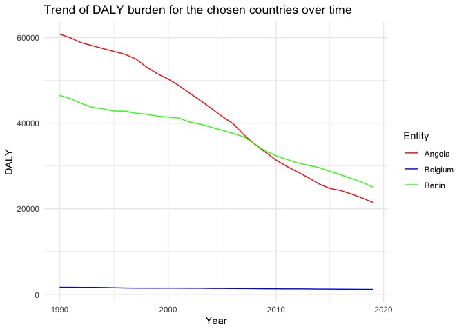

Global Disease Burden Analysis
================
Alimatou Héma

# Introduction

This document compares the Disability-Adjusted Life Year (DALY) diseases
burden for three countries: Belgium, Benin, and Angola. We compare the
burden due to communicable, maternal, neonatal, and nutritional diseases
(CMNN), non-communicable diseases (NCDs), and overall disease burden for
these countries.

The source data is from the Institute for Health Metrics and Evaluation
(IHME) Global Burden of Disease (GBD) study.

## Table of Estimates for CMNN Burden Over Time

| Year |   Angola |  Belgium |    Benin |
|-----:|---------:|---------:|---------:|
| 1990 | 60834.03 | 1667.199 | 46486.57 |
| 1991 | 59947.46 | 1664.583 | 45739.86 |
| 1992 | 58790.54 | 1633.754 | 44593.95 |
| 1993 | 58131.63 | 1639.250 | 43724.30 |
| 1994 | 57449.72 | 1609.164 | 43363.40 |
| 1995 | 56765.55 | 1550.999 | 42832.16 |
| 1996 | 56124.06 | 1491.597 | 42829.97 |
| 1997 | 55033.19 | 1468.288 | 42325.98 |
| 1998 | 53145.02 | 1462.192 | 42088.41 |
| 1999 | 51554.03 | 1458.358 | 41663.56 |
| 2000 | 50329.27 | 1468.718 | 41441.71 |
| 2001 | 48792.86 | 1457.332 | 41199.29 |
| 2002 | 46979.30 | 1443.474 | 40261.63 |
| 2003 | 45261.28 | 1445.597 | 39754.88 |
| 2004 | 43447.86 | 1402.589 | 39052.45 |
| 2005 | 41554.97 | 1398.851 | 38352.29 |
| 2006 | 39911.41 | 1375.343 | 37598.69 |
| 2007 | 37318.36 | 1367.887 | 36817.58 |
| 2008 | 35110.98 | 1350.076 | 35168.62 |
| 2009 | 33209.46 | 1321.977 | 33466.29 |
| 2010 | 31372.28 | 1313.344 | 32388.35 |
| 2011 | 29892.18 | 1292.603 | 31527.01 |
| 2012 | 28580.45 | 1297.399 | 30707.77 |
| 2013 | 27260.90 | 1279.322 | 30150.57 |
| 2014 | 25792.09 | 1247.926 | 29630.13 |
| 2015 | 24752.86 | 1241.004 | 28741.84 |
| 2016 | 24262.38 | 1221.316 | 27954.84 |
| 2017 | 23424.51 | 1208.347 | 27065.90 |
| 2018 | 22531.07 | 1195.033 | 26195.00 |
| 2019 | 21500.33 | 1181.466 | 25070.46 |

## Plot Showing Trends in CMNN Burden Over Time

<!-- -->

## Summary of CMNN Burden Findings

This report analyzes the burden of CMNN conditions in three countries:
Angola, Belgium, and Benin, over the period from 1990 to 2020. Belgium
exhibited the lowest Disability-Adjusted Life Years (DALY) burden among
the three countries throughout the study period. This suggests
relatively better health outcomes and healthcare infrastructure compared
to Angola and Benin.
